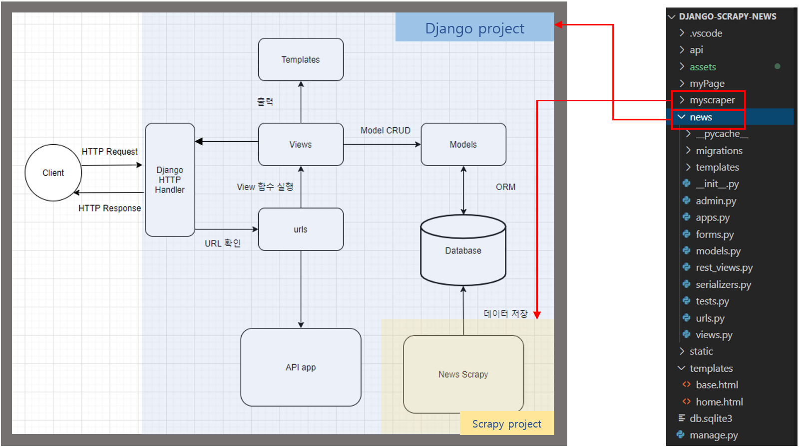
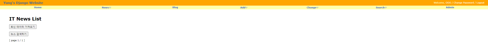
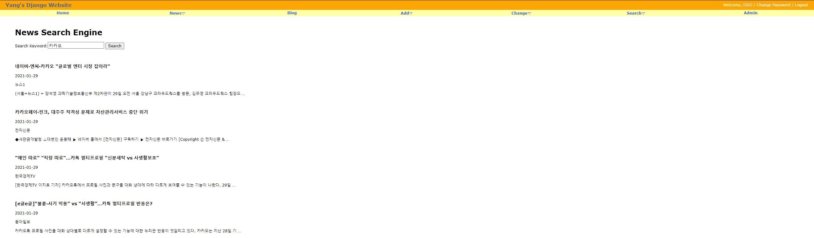
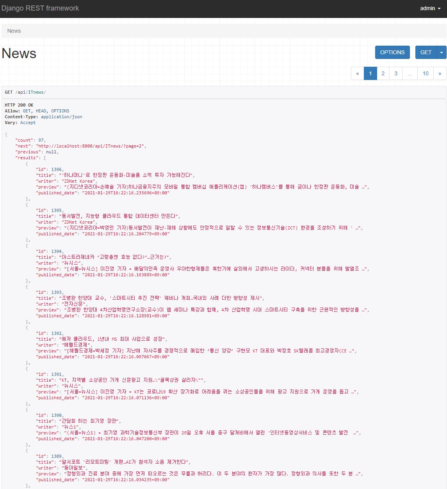

# Learn Django With Scrapy

> Crawling IT news site: https://news.naver.com/main/list.naver?mode=LS2D&mid=shm&sid1=105&sid2=230&page=1
> By using Scrapy and Django

<br/><br/>

## 💻 Start Project

```python
# Scrapy Project
scrapy startproject myscrapy # start scrapy project
scrapy genspider mybot domin # scrapy bot
```

```python
# Django project
django-admin startproject django-scrapy-news
python manage.py migrate
python manage.py startapp news
python manage.py runserver
```

```python
sudo fuser db.sqlite3
kill -9 43868
```

---

<br/><br/>

## Project structure



---

<br/><br/>

## 👍 Project result

> project demo show

<br/>

#### before crawling



<br/>

#### After crawling


<br/>

#### Search engine



<br/>

#### RESTful API



---


<br/><br/>

## 💻 Development Stack

|    division     |       stack        |
| :-------------: | :----------------: |
|    Framework    |       Django       |
|    Front-end    | Python, html, css  |
|    Back-end     |   Python, Scrapy   |
|       db        |       Sqlite       |
